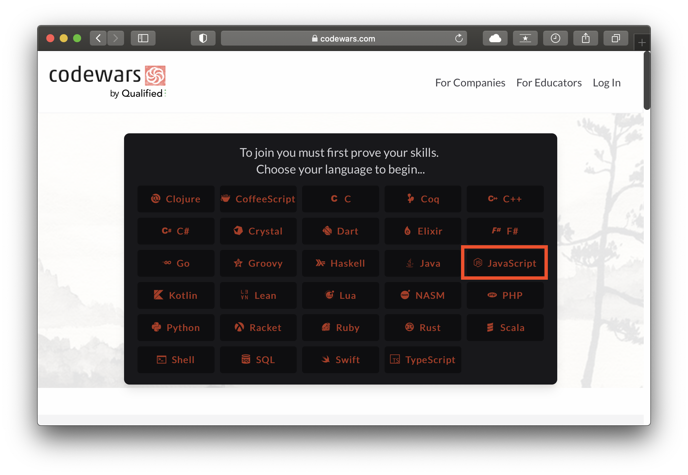
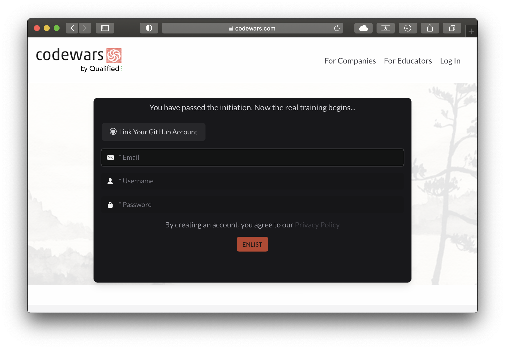
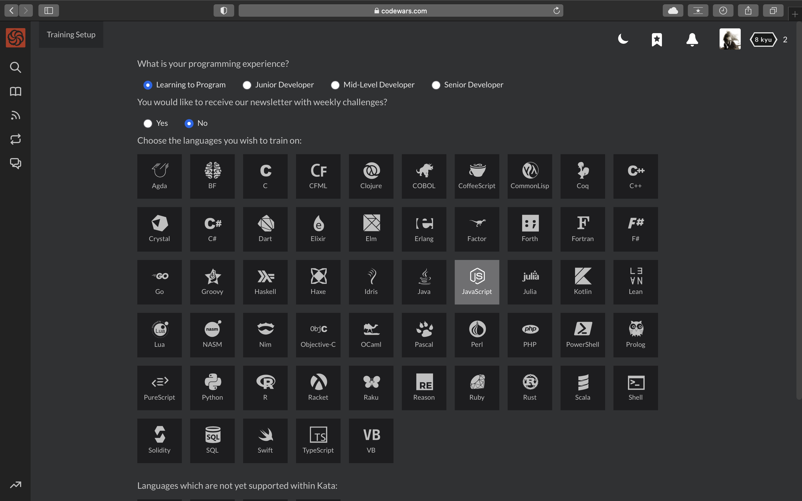

# Как зарегистрироваться на codewars.com
Заходим на сайт [codewars](https://www.codewars.com/join)
и выбираем `JavaScript`

  

Решаем несложную задачу и жмем `SUBMIT`

  

Далее заполняем поля:
- добавляйте ваш email адресс
- username должен совпадать с вашим username телеграмма. **ЭТО ОЧЕНЬ ВАЖНО**
- запишите пароль

  

## username codewars должен совпадать с username телеграмма

>> [статья "как добавить username в телеграмм](https://telegramzy.ru/nik-v-telegramm/)

Теперь заполните небольшую анкету и жмите `SAVE`

  

Поздравляем! Вы зарегистрировались в codewars 🎉